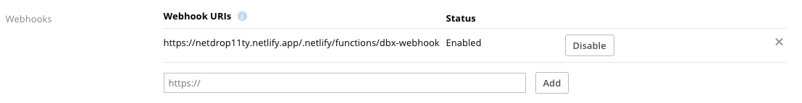

# netdrop11ty


Extremely minimal Eleventy starter to kickstart a simple multi-page site getting content from Dropbox Folders.

[](https://app.netlify.com/sites/netdrop11ty/deploys)

## TL;DR

1. Place content (.md files, images) on a Dropbox folder
2. This triggers a Netlify build for a 11ty SSG site
3. Go to your site and enjoy!

# Setting up in 5 steps

## Requirements

You'll need to have 3 free accounts on:

- Dropbox
- Netlify
- Github (or Gitlab, Bitbucket)

### 1. Clone this repo to your account on GitHub (or another provider)

You don't need to be a git expert to do this. You can use the `fork` button on Github's UI, or use a free visual tool like [Github Desktop](https://desktop.github.com/) or [Atlassian Source Tree](https://www.sourcetreeapp.com/).

Cloning is just copying these source files to a place where you can edit them. Using those desktop apps will put them in your computer for local acess, `forking` will create a copy you can edit online on github using the browser.


### 2. Create Dropbox App to hold your content

Log into your Dropbox account in the browser, and go to the [My apps page](https://www.dropbox.com/developers/apps). There you can create an App, which is a particular folder that your site will access and get content from.


Make sure to select `Scoped Access` and `App folder`, so your site will only have access to this App's folder, not your entire account. Choose a fancy name and go configure your App!


Your App will be created. Now check the settings and make sure that `Permission type` is scoped. Check the `App folder name`, and change `Access token expiration` to `No expiration` if you like.

Click on `Generate access token` and copy that value. You'll need it later.

You can see in the screenshot the `Webhook URIs` filled in, but no worries, we'll do it later.


#### Important: set the right permissions

This got me a couple times. You'll get `400` errors if you forget this. Go to the permissions tab and check `Files and folders` permissions. You need to make sure `files.metadata.read` and `files.content.read` are checked. Save, and for now, we're done in Dropbox.


### 3. Create a new Netlify site from your GitHub repo

On Netlify, create a new site from git. Follow the authorization prompts, find your repo, connect it to Netlify.


#### 3.1 Netlify site settings

There are a couple steps to do here.

Go to the `Site Settings` option (top right), and let's start.


The first one is to customize the `Site name` to something that makes more sense to you. This will be used in the URL and is unique to the whole Netlify. In the example here, I chose `netdrop11ty.netlify.app`

Next, create a `Build hook`. Just click the button `Add` and accept defaults. Give it the following name: `NETLIFY_BUILD_HOOK_URL`

Then, go to `Build & Deploy` → `Environment variables`. You'll create 3 `ENV` variables:

```shell
CONTENT_DIR: ./src/dbx
DBX_ACCESS_TOKEN: [YOUR DROPBOX TOKEN]
NETLIFY_BUILD_HOOK_URL: [THE GENERATED BUILD HOOK IN THE STEP ABOVE]
```

#### 3.2 Netlify functions


Go to the functions menu, and change its `Function Directory` settings to `src/_netlify-function`.

In the next deployment, this will create a function that you'll need next. Load the [functions](https://app.netlify.com/sites/netdrop11ty/functions) page, and you should now see:


Clicking on it will give you access to the function URL that we need. It's easy to infer as well. In my case is `https://netdrop11ty.netlify.app/.netlify/functions/dbx-webhook`

`https://netdrop11ty.netlify.app`: Netlify's site domain

`.netlify/functions`: Auto-generated functions folder (you won't see it in your machine)

`dbx-webhook`: The filename, that you'll find in your machine at `./src/_netlify/_netlify-function/dbx-webhook.js`

##### Important

If you edit your site name, this changes your URL. Remember to change the `webhook` setting in your Dropbox app settings, otherwise it would call the wrong URL.

---

Dropbox has a particularity that we need to deal with through Netlify's functions. The first request you do to dbx API will give you a _challenge_ query string parameter and requires another request with the same parameter back. After that, you can actually request the files.

Therefore we need a [Netlify function](https://docs.netlify.com/functions/overview/?_ga=2.144098101.108854660.1628386823-1325281063.1626650890), which is going to be executed on every build before we request the actual folder contents to dropbox. So here's what happens when you `build`:

1. Netlify function sends an API request to Dropbox → `dbx-webhook.js`
2. Dropbox answers with a challenge param
3. Netlify function responds back with challenge parameter. We're clear with DBX
4. Netlify runs `npm run build` from our `package.json`, which triggers `get-content-from-dbx.js` first
5. With the DBX content, 11ty builds the site with updated content and puts in `_site`. Netlify deployment is **done**

I got the [function](https://github.com/jimniels/netlibox/blob/master/src/_netlify-functions/dropbox-webhook.js) from netlibox repo, thanks once more, [Jim](https://github.com/jimniels)!

It's possible to test this function locally if you install `netlify-lambda`. I haven't because it has some security issues and installs webpack; I preferred not to. If you do, please check [netlibox](https://github.com/jimniels/netlibox/), which does.

### 4. Netlify functions into Dropbox

Remember the [Dropbox App console](https://www.dropbox.com/developers/apps)? Let's go back there and finish the configuration.

Scroll the page until you find `Webhooks URI`, and add the one you just copied above.

.

If all goes well, you should see an `Enabled` status. If not, delete it, go back to Netlify to get the correct URL and add it.

If you forgot to add the proper permissions in Dropbox and start to get a 400, add the permission, generate a new access token and put it into Netlify UI.

### 5. Last step: `.env` file

Now you already have all the elements. Just rename the local `.env.example` file to `.env` (it's inside .gitignore, so your tokens are not shared) and fill `DBX_ACCESS_TOKEN` and `NETLIFY_BUILD_HOOK_URL` as you've done in Netlify's UI.

And from here? `Deploy`!
